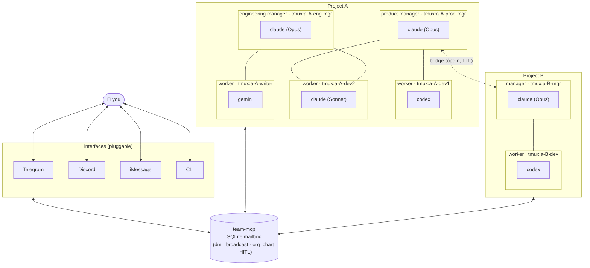

# teamctl

**docker-compose for persistent AI agent teams.**

Declare a team of long-lived Claude Code, Codex CLI, or Gemini CLI sessions in YAML. Every agent is its own real CLI running in its own `tmux` pane, supervised by `tmux` (portable), `systemd` (Linux), or `launchd` (macOS). They coordinate through a shared MCP mailbox. Each project has its own private org-chart with one or more managers; you talk to those managers over pluggable **interfaces** (Telegram, Discord, iMessage, CLI, webhook). Brand-sensitive actions pause for your approval.

```bash
curl -sSf https://teamctl.run/install | sh   # not yet live
teamctl init hello-team
teamctl up
```

## How it works



- **Every node is a separate long-lived CLI** — Claude Code, Codex, or Gemini — running in its own `tmux` pane. No shared process, no "roles inside one LLM."
- **Projects are self-contained org charts.** One project can have many managers and many workers; workers are wired to one or more managers through `reports_to`. Agents can call `org_chart` to introspect their chain of command.
- **Managers talk to each other** inside a project (shared `#leads` channel or DM). Across projects they're isolated — a one-off **bridge** opens a manager-to-manager link for a limited time.
- **You reach managers through any of the configured interfaces.** Telegram is the first adapter; Discord, iMessage, CLI, and webhooks plug in the same way.
- **Brand-sensitive actions pause.** Tool calls tagged `publish`, `release`, `deploy`, `payment`, … block on `request_approval` and surface on your chosen interface with Approve / Deny.

## Status

Early. v0.1 under active development — see [ROADMAP](./ROADMAP.md) and the [CHANGELOG](./CHANGELOG.md).

## What you get

- Persistent Claude Code / Codex / Gemini CLI sessions in `tmux`
- Real-time DMs and channels (SQLite-backed, sub-5 ms)
- Multi-project isolation with opt-in bridges
- Human-in-the-loop approvals for brand-sensitive actions
- Declarative YAML — change it, run `teamctl reload`, zero downtime

## Docs

- [Getting started](./docs/getting-started.md)
- [Concepts](./docs/concepts/) — projects, channels, runtimes, bridges, HITL
- [Reference](./docs/reference/) — `team-compose.yaml`, CLI, runtimes
- [Guides](./docs/guides/) — multi-runtime, Telegram bot, ops
- [ADRs](./docs/adrs/) — architectural decisions

## License

[MIT](./LICENSE)
