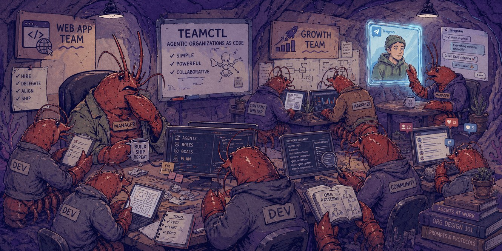

<p align="center">
  
</p>

# teamctl

**Run real AI agent teams from one YAML. Each agent is a long-lived CLI process.**

Long-running AI agents — Claude Code, Codex, or Gemini sessions — declared in a YAML file you write yourself, supervised on your machine. Each agent runs in its own `tmux` pane; they coordinate through a shared mailbox. If you've used docker-compose, the shape is similar — declarative, supervised, file under your version control. The manager pauses for you on anything that matters.

## Interactive Setup (with Claude Code) - _Recommended_ ⭐

```bash
claude plugin marketplace add https://github.com/Alireza29675/teamctl
claude plugin install teamctl@teamctl
# inside a Claude Code session:
/teamctl:init
# back in your shell:
teamctl ui
```

The plugin walks you through what kind of team you want, scaffolds a `.team/` folder in your project, brings the agents up, and shows you everything in `teamctl ui`.

## Manual setup 🔧

Install teamctl:

```bash
curl -fsSL https://teamctl.run/install | sh
```

Then bring up a team:

```bash
cd /to/your/project
teamctl init # initiates the .team/ folder in your project
teamctl bot setup # helps you connect 'managers' to Telegram bots
teamctl up # starts the team
teamctl ui # interactive team inspection
```

`init` writes the `.team/` folder, `bot setup` wires Telegram for the manager, `up` brings the team online, `ui` shows you what's happening.

## Learn more 🔍

- [Documentation](https://teamctl.run) — guides, concepts, reference, ADRs
- [Example teams](https://github.com/Alireza29675/teamctl/tree/main/examples) — OSS maintainer, editorial room, indie studio, solo triage
- [How teamctl compares](https://teamctl.run/compare/) — feature matrix vs neighboring tools

## License

[MIT](./LICENSE)
