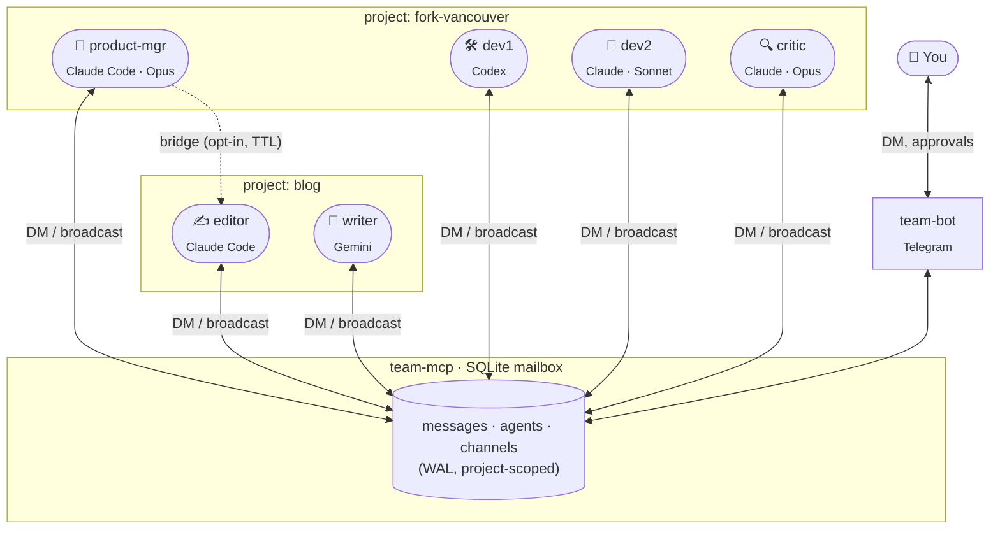

# teamctl

**docker-compose for persistent AI agent teams.**

Declare a team of long-lived Claude Code, Codex CLI, or Gemini CLI sessions in YAML. They live in `tmux`, are supervised by `systemd` (Linux) or `launchd` (macOS) — or just `tmux` on any box — and talk to each other through a shared MCP mailbox. One manager per project chats with you on Telegram. Brand-sensitive actions pause for your approval.

```bash
curl -sSf https://teamctl.run/install | sh   # not yet live
teamctl init hello-team
teamctl up
```

## How it works



- Each agent is a real long-lived CLI session in its own `tmux` pane — **not** an in-process role.
- They only share memory through the mailbox. MCP tools (`dm`, `broadcast`, `inbox_watch`, `list_team`) are the whole API.
- Projects are isolated by default. Two managers in different projects can only DM each other while a **bridge** is open.
- Any action tagged `publish`, `release`, `payment`, `deploy`, etc. pauses on `request_approval` and shows up in Telegram with Approve / Deny buttons.

## Status

Early. v0.1 under active development — see [ROADMAP](./ROADMAP.md) and the [CHANGELOG](./CHANGELOG.md).

## What you get

- Persistent Claude Code / Codex / Gemini CLI sessions in `tmux`
- Real-time DMs and channels (SQLite-backed, sub-5 ms)
- Multi-project isolation with opt-in bridges
- Human-in-the-loop approvals for brand-sensitive actions
- Declarative YAML — change it, run `teamctl reload`, zero downtime

## Docs

- [Getting started](./docs/getting-started.md)
- [Concepts](./docs/concepts/) — projects, channels, runtimes, bridges, HITL
- [Reference](./docs/reference/) — `team-compose.yaml`, CLI, runtimes
- [Guides](./docs/guides/) — multi-runtime, Telegram bot, ops
- [ADRs](./docs/adrs/) — architectural decisions

## License

[MIT](./LICENSE)
