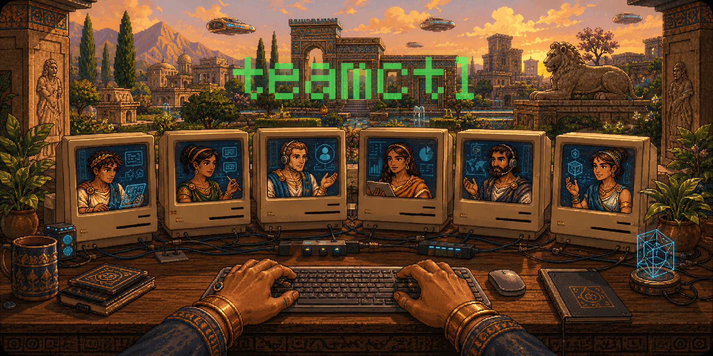

<p align="center">
  
</p>

# teamctl

**A team of AI agents, collaborating over a messaging system, all declared in YAML. Persistent and scalable.**

Each agent is a real Claude Code, Codex, or Gemini session with its own identity, its own memory, and a domain it owns end-to-end. They talk to each other through a durable mailbox. They collaborate the way real teammates do: handing off, pushing back, picking up where the other left off, asking for help when they need it, keeping the work moving while you sleep. You stay in the loop on what matters through Telegram, the TUI, or the CLI.

teamctl is built for **TeamOps**: the operational discipline of running teams of agents at scale. Read [How to think about agent teams](https://teamctl.run/concepts/teams/) for the methodology. Or skip to the examples below.

## Install

```bash
curl -fsSL https://teamctl.run/install | sh
```

That's it. The installer puts `teamctl`, `team-mcp`, `team-bot`, and `teamctl-ui` on your `$PATH`, plus the Claude Code plugin if `claude` is detected.

## Start a team

Inside your project directory, with Claude Code installed:

```bash
cd /path/to/your/project
claude /teamctl:init
```

The plugin walks you through a real conversation (not a template menu) that surfaces the *domains* in your work and proposes a team shape around them. By the time you're done, `.team/team-compose.yaml` is on disk and the team is running in `tmux`.

If you'd rather hand-author the team yourself, read the [handbook](https://teamctl.run/concepts/teams/) first. It's the cognitive frame the guided flow would have walked you through.

## Examples

These are real teams running on teamctl. Copy any of them as a starting point.

🌱 **[Personal research](examples/personal-research/).** Two agents (buddy + curator). The buddy holds your reading list and the compounding mental model of what you actually care about; the curator runs on a loop following the news on your declared interests and surfaces what matters. The smallest valid teamctl team.

💼 **[Job finder](examples/job-finder/).** Three agents (lead + scout + matcher). Scout watches job boards, matcher does the deep CV-to-posting alignment, lead handles your applications domain and talks to you on Telegram. Drafts cover letters in your voice; you tap to send.

📈 **[Market analysis](examples/market-analysis/).** Four agents on a read-only research desk (chief + collector + interpreter + risk). Tells you when something's worth your attention; never moves money on its own. HITL on anything that touches the bank account.

🏗️ **[SaaS product team](examples/saas-product/).** Seven agents running a small SaaS by domain. Platform + auth + billing + dashboards + docs-site + community, with a product_lead on top holding the roadmap. Each owns one product surface end-to-end.

More examples live under [`examples/`](examples/).

## What a team looks like

A project YAML, with one manager and a couple of workers:

```yaml
version: 2

project:
  id: side-project

channels:
  - name: all
    members: "*"

managers:
  manager:
    runtime: claude-code
    model: claude-opus-4-7
    role_prompt: roles/manager.md
    interfaces:
      telegram:
        bot_token_env: TEAMCTL_TG_MANAGER_TOKEN
        chat_ids_env: TEAMCTL_TG_MANAGER_CHATS

workers:
  frontend:
    runtime: codex
    model: gpt-5-codex
    role_prompt: roles/frontend.md
    reports_to: manager

  backend:
    runtime: claude-code
    model: claude-sonnet-4-6
    role_prompt: roles/backend.md
    reports_to: manager
```

Then:

```bash
teamctl validate    # check the YAML
teamctl up          # bring the team up
teamctl ui          # watch them work
teamctl status      # is everyone alive?
```

You can attach to any agent's tmux pane to read along: `teamctl attach side-project:frontend`. You can also DM them from the CLI: `teamctl send side-project:manager "what's on my plate?"`.

## What you get

- **Persistent agents.** Each one has identity, memory, and a domain. They survive reboots.
- **A durable mailbox.** SQLite-backed, async, allowlisted. Agents DM and broadcast through it; you can audit every line.
- **HITL when it matters.** `publish`, `release`, `deploy`, `external_email`. Every sensitive action pauses for your tap on Telegram before it ships.
- **Multi-runtime.** Mix Claude Code, Codex, and Gemini in the same team. Different agents can use different keys for billing or rate-limit headroom.
- **Project isolation.** Run unrelated teams side-by-side without cross-talk. Bridge two projects only when you mean to.
- **Telegram, today.** Discord, email, and more on the way.

## Learn more

- 📖 [How to think about agent teams](https://teamctl.run/concepts/teams/) for the methodology, the two-gate framing, and what TeamOps means in practice.
- 📚 [Documentation](https://teamctl.run) for full docs, concepts, reference, and ADRs.
- 🧪 [How teamctl compares](https://teamctl.run/compare/) for the feature matrix vs neighboring tools. No put-downs.

## License

[MIT](./LICENSE)
