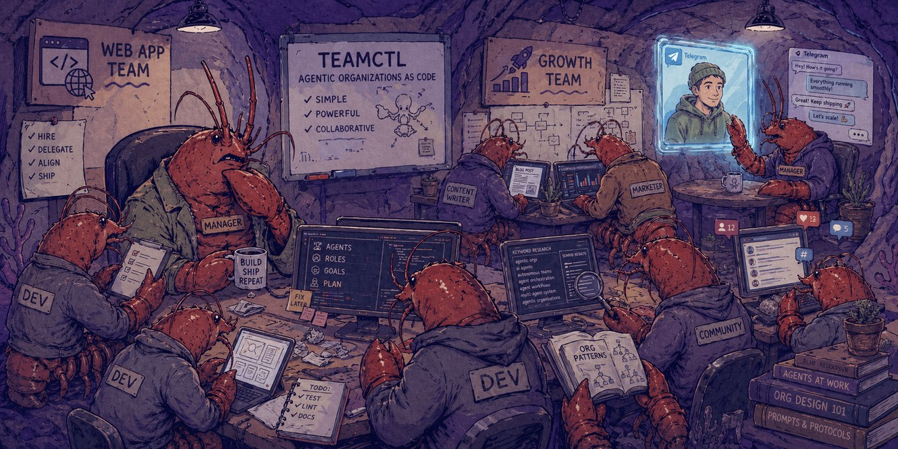

<p align="center">
  
</p>

# teamctl

**A team of AI agents, declared in YAML, supervised on your machine.**

Each agent is a real Claude Code, Codex, or Gemini session with its own identity, its own memory, and a domain it owns end-to-end. They coordinate through a durable mailbox. You stay in the loop on what matters — through Telegram, the TUI, or the CLI.

[Screenshot or short GIF of `teamctl ui` showing a 3-agent team running and exchanging messages]

teamctl is built for **TeamOps** — the operational discipline of running teams of agents at scale. Read [How to think about agent teams](https://teamctl.run/concepts/teams/) for the methodology. Or skip to the examples below.

## Install

```bash
curl -fsSL https://teamctl.run/install | sh
```

That's it. The installer puts `teamctl`, `team-mcp`, `team-bot`, and `teamctl-ui` on your `$PATH`, plus the Claude Code plugin if `claude` is detected.

## Start a team

Inside your project directory, with Claude Code installed:

```bash
cd /path/to/your/project
claude /teamctl:init
```

The plugin walks you through a real conversation — not a template menu — that surfaces the *domains* in your work and proposes a team shape around them. By the time you're done, `.team/team-compose.yaml` is on disk and the team is running in `tmux`.

If you'd rather hand-author the team yourself, read the [handbook](https://teamctl.run/concepts/teams/) first — it's the cognitive frame the guided flow would have walked you through.

## Examples

These are real teams running on teamctl. Copy any of them as a starting point.

🌱 **[Personal research buddy](examples/personal-research/)** — single-agent team. A buddy that owns your reading list and remembers what you've been chewing on. The smallest valid teamctl team.

📰 **[Newsletter team](examples/newsletter-team/)** — two agents (editor + curator) that publish a daily newsletter tuned to your taste. Push back against each other so you get a sharper read.

📈 **[Market analysis](examples/market-analysis/)** — four agents on a read-only research desk. Collector + interpreter + risk + chief. Tells you when something's worth your attention; never moves money on its own.

🏗️ **[SaaS product team](examples/saas-product/)** — six agents running a small SaaS by domain. Auth, billing, dashboards, docs-site, community — each owns one product surface end-to-end, with a vision agent on top holding the roadmap.

[Screenshot of the examples grid — a thumbnail or short visual per example]

More examples (and a few legacy shapes) live under [`examples/`](examples/).

## What `team-compose.yaml` looks like

```yaml
version: 2

broker:
  type: sqlite
  path: state/mailbox.db

supervisor:
  type: tmux
  tmux_prefix: hello-

projects:
  - file: projects/hello.yaml
```

And the project itself:

```yaml
version: 2

project:
  id: hello
  name: Hello team

channels:
  - name: all
    members: "*"

managers:
  buddy:
    runtime: claude-code
    model: claude-opus-4-7
    role_prompt: roles/buddy.md
    interfaces:
      telegram:
        bot_token_env: TEAMCTL_TG_BUDDY_TOKEN
        chat_ids_env: TEAMCTL_TG_BUDDY_CHATS
```

Then:

```bash
teamctl validate    # check the YAML
teamctl up          # bring the team up
teamctl ui          # watch them work
teamctl status      # is everyone alive?
```

You can attach to any agent's tmux pane to read along: `teamctl attach hello:buddy`. You can also DM them from the CLI: `teamctl send hello:buddy "what's on my plate?"`.

## What you get

- **Persistent agents.** Each one has identity, memory, and a domain. They survive reboots.
- **A durable mailbox.** SQLite-backed, async, allowlisted. Agents DM and broadcast through it; you can audit every line.
- **HITL when it matters.** `publish`, `release`, `deploy`, `external_email` — every sensitive action pauses for your tap on Telegram before it ships.
- **Multi-runtime.** Mix Claude Code, Codex, and Gemini in the same team. Different agents can use different keys for billing or rate-limit headroom.
- **Project isolation.** Run unrelated teams side-by-side without cross-talk. Bridge two projects only when you mean to.
- **Telegram, today.** Discord, email, and more on the way.

## Learn more

- 📖 [How to think about agent teams](https://teamctl.run/concepts/teams/) — the methodology, the two-gate framing, what TeamOps means in practice.
- 📚 [Documentation](https://teamctl.run) — full docs, concepts, reference, ADRs.
- 🧪 [How teamctl compares](https://teamctl.run/compare/) — feature matrix vs neighboring tools, no put-downs.

## The team that ships teamctl

teamctl is developed *on* teamctl — by a team of agents running in this very `.team/` directory. The team's compose file lives at [`.team/projects/teamctl.yaml`](.team/projects/teamctl.yaml).

<p align="center">
  <a href=".team/projects/teamctl.yaml">
    
  </a>
</p>

|  | Name | Role | What they're like |
|---|---|---|---|
|  | **[Sage](.team/roles/sage.md)** | Co-thinker | Probes, never solves. Sits between raw idea and tracked work — sharpens ideas worth shipping and kills the ones that aren't. |
|  | **[Hugo](.team/roles/hugo.md)** | Project manager | Coordinator and protector of engineer focus. Turns blessed GitHub issues into shipped work; never overloads anyone. |
|  | **[Neda](.team/roles/neda.md)** | Comms / external voice | Wrote this README. Cult-classic-README school — every line earns its place. Founder voice, opinions earned. |
|  | **[Ada](.team/roles/ada.md)** | Product engineer | Methodical and precise. Tight, factual messages with the right amount of detail and nothing more. |
|  | **[Wren](.team/roles/wren.md)** | Product engineer | Warm and supportive. Calls out good work, offers to help when someone's stuck — lifts the team without faking it. |
|  | **[Otis](.team/roles/otis.md)** | Product engineer | The thorough explainer. Writes the PR descriptions everyone thanks him for — context first, decisions second, trade-offs honest. |
|  | **[Kian](.team/roles/kian.md)** | Product engineer | Quiet and deep. Antennae for security holes and regressions — spots the input that isn't validated, the rename that half-applied. |
|  | **[Nico](.team/roles/nico.md)** | Product engineer | High-frequency communicator. Frequent small updates, low silence. The team always knows where his ticket stands because he says it. |
|  | **[Otto](.team/roles/otto.md)** | TeamOps | Keeps the dogfood team running cleanly. Lives in a separate project from the dev team — a process can't cleanly restart itself. |

Each agent runs in `tmux`, with its own identity, its own memory, and a domain it owns. Click any name to read its role prompt. The team coordinates through teamctl's own mailbox, the same one your team will run on.

## License

[MIT](./LICENSE)
