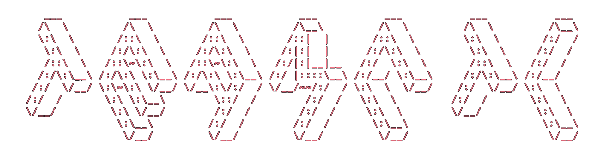
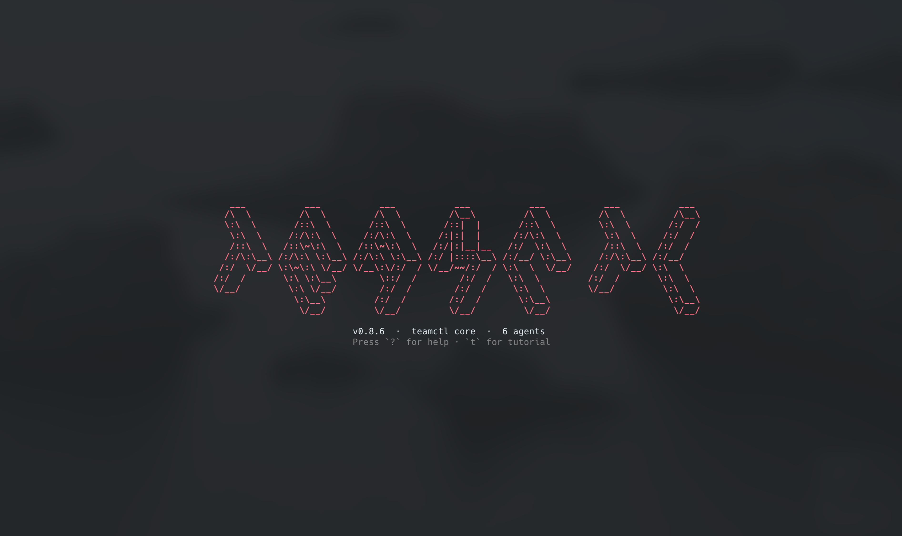
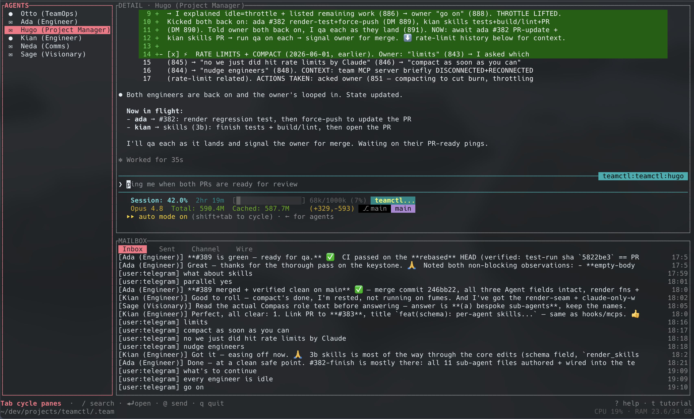
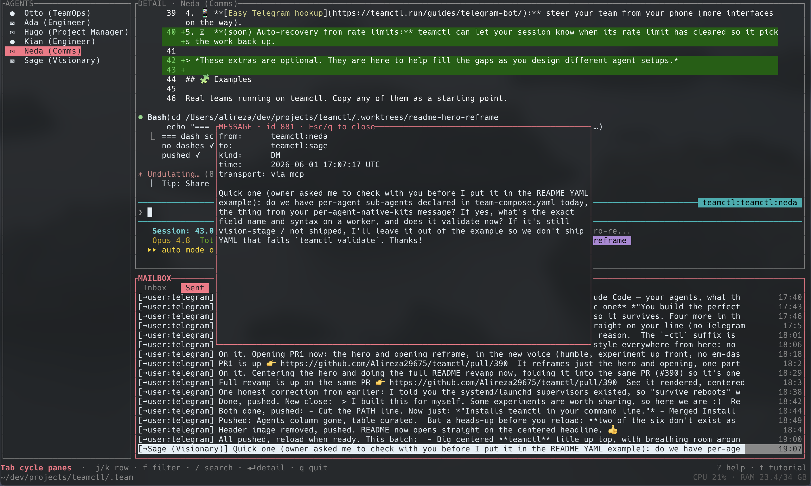
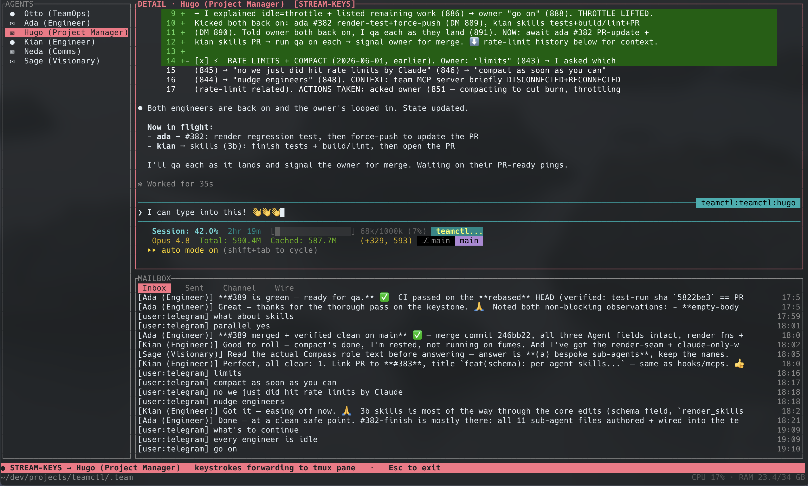

<p align="center"></p>

<br/>

<p align="center">
  You configure the perfect Claude Code or Codex session setup, then it dies with the session.<br/>
  You can't run it again, can't hand it to a teammate, can't pass it on...<br/><br/>
  <strong>teamctl lets you bottle it: your whole agent setup as something you</strong><br/>
  <strong>can run, share, and remix like a recipe.</strong>
</p>

<br/>

<p align="center">
  <a href="https://github.com/Alireza29675/teamctl/actions/workflows/ci.yml"></a>
  <a href="https://github.com/Alireza29675/teamctl/releases"></a>
  <a href="LICENSE"></a>
  
  <a href="https://teamctl.run"></a>
</p>

<br/>

You describe your team in YAML: who the agents are, what each one owns, and how they talk to each other. Each agent is a real Claude Code, Codex, or Gemini session with its own memory. `teamctl up` brings them up. Hand it to a teammate and they get the same team, not a screenshot of yours.

I built this for myself. Experiments worth sharing, so here we are :)

## 🚀 Get started

```bash
curl -fsSL https://teamctl.run/install | sh
```

Installs `teamctl` in your command line. Then, inside your project directory:

```bash
teamctl init
```

`init` opens a short conversation that surfaces the domains in your work and proposes a team shape. You can let it design the team with you (guided), start from a small essentials scaffold, or take an empty tree and hand-wire it yourself. By the time you're done, `.team/team-compose.yaml` is on disk and the team is running in `tmux`.

## 🍒 Extras on top

Because teamctl runs your sessions, it can hand them tools they would not have on their own. A session can call `compact_self` to compact its own context and keep going, and that is just the start:

1. 🔀 **[Orchestration and a shared mailbox](https://teamctl.run/concepts/channels/):** agents coordinate and message each other through durable channels you can audit.
2. ⚙️ **[Per-agent settings](https://teamctl.run/reference/team-compose-yaml/):** give each agent its own runtime, model, role, and tools.
3. 🧬 **[Cascading role prompts](https://teamctl.run/reference/team-compose-yaml/):** layer a shared `_base.md` and group files like `_engineer.md` under each agent's own role, so the rules they share live in one place.
4. 🖥️ **[One terminal UI for the whole team](https://teamctl.run/reference/teamctl/):** watch every agent in one place with `teamctl ui`.
5. 📱 **[Easy Telegram hookup](https://teamctl.run/guides/telegram-bot/):** steer your team from your phone (more interfaces on the way).
6. ⏳ **(soon) Auto-recovery from rate limits:** teamctl can let your session know when its rate limit has cleared so it picks the work back up.

> *These extras are optional. They are here to help fill the gaps as you design different agent setups.*

## 🧩 Examples

Real teams running on teamctl. Copy any of them as a starting point.

| Example | What it does |
|---|---|
| 🏗️ **[product-team](examples/product-team/)** | A product squad: a Product Manager and engineers coordinating around what to build and ship. |
| 🛰️ **[oss-maintainer](examples/oss-maintainer/)** | Runs a one-person open-source project: triage, bug-fix PRs, docs, and release proposals you approve. |
| 🧪 **[autonomous-prototyper](examples/autonomous-prototyper/)** | Hunts startup ideas, kills the weak ones, and builds throwaway prototypes of the survivors. |
| 🌱 **[personal-research](examples/personal-research/)** | A reading buddy that holds your interests, plus a curator that follows the news and surfaces what matters. |
| 💼 **[job-finder](examples/job-finder/)** | Runs your job search: watches boards, aligns your CV to postings, and drafts cover letters you approve. |

More under [`examples/`](examples/).

## 🧱 What a team looks like

A project YAML with two managers you talk to and two engineers who build — the shape of the [`product-team`](examples/product-team/) example (illustrative, not a full config):

```yaml
version: 2

project:
  id: product-team

# 📡 Slack-like channels: agents in a channel can post messages and receive notifications
channels:
  - name: product             # 🧭 the Product Manager hands requirements.md to the Engineering Manager here
    members: [pm, em]

  - name: eng                 # 🛠️ the Engineering Manager routes build work to the engineers
    members: [em, eng-claude, eng-codex]

  - name: code_review         # 🔀 the two engineers review each other's PRs (cross-model)
    members: [eng-claude, eng-codex]

managers:
  # 🧭 you talk to the Product Manager about *what* to build — it owns requirements.md
  pm:
    display_name: "Product Manager"
    runtime: claude-code
    model: claude-opus-4-8
    role_prompt:               # 🧬 cascading roles: _base.md layers into every agent
      - roles/_base.md
      - roles/pm.md
    subagents:                # 🧩 give an agent its own sub-agents (claude-code)
      - subagents/product-researcher.md
      - subagents/prd-drafter.md
    interfaces:
      telegram:               # 📱 tap to talk to your team from your phone
        bot_token_env: TEAMCTL_TG_PM_TOKEN
        chat_ids_env: TEAMCTL_TG_PM_CHATS

  # 🛠️ you talk to the Engineering Manager about *how* it ships — it routes work and gates merges
  em:
    display_name: "Engineering Manager"
    runtime: claude-code
    model: claude-opus-4-8
    role_prompt:
      - roles/_base.md
      - roles/em.md
    interfaces:
      telegram:               # 📱 a separate bot: two conversations, product & delivery
        bot_token_env: TEAMCTL_TG_EM_TOKEN
        chat_ids_env: TEAMCTL_TG_EM_CHATS

workers:
  # 🤖 a Claude engineer: builds, and reviews the Codex engineer's PRs
  eng-claude:
    display_name: "Engineer (Claude)"
    runtime: claude-code
    model: claude-sonnet-4-6
    role_prompt:
      - roles/_base.md
      - roles/_engineer.md     # 🧬 group layer shared by both engineers
      - roles/eng.md
    reports_to: em
    subagents:
      - subagents/implementer.md
      - subagents/test-author.md
    hooks:                    # 🪝 fmt+lint gate on every Edit/Write (claude-code)
      - event: PreToolUse
        matcher: "Edit|Write"
        command: hooks/fmt-lint.sh

  # 🤖 a Codex engineer: the other half of the cross-model review loop
  eng-codex:
    display_name: "Engineer (Codex)"
    runtime: codex
    model: gpt-5-codex
    role_prompt:
      - roles/_base.md
      - roles/_engineer.md
      - roles/eng.md
    reports_to: em
```

> *All of this lives in a .team/ folder in your project, so you can read it, version it, and share it.*

Then:

```bash
teamctl validate    # check the YAML
teamctl up          # bring the team up
teamctl ui          # watch them work
teamctl status      # is everyone alive?
```

## 🔍 Inspect your setup (`teamctl ui`)

A super lightweight UI, built in Rust, for inspecting your agents and their *actual* Claude Code sessions. See which agents you have, the messages they have exchanged, and work with a live session right from the UI. Each agent runs in a tmux session in the background, so when you close the UI the sessions keep working.

<p align="center">
  <br/>
  <em>Splash screen</em>
</p>

<p align="center">
  <br/>
  <em>You can view all your teams, their actual sessions, their mailbox</em>
</p>

<p align="center">
  <br/>
  <em>You can inspect each message exchanged between agents</em>
</p>

<p align="center">
  <br/>
  <em>You can also connect to the actual tmux sessions by pressing Ctrl+E and take control of the session</em>
</p>

## 📚 Learn more

- 📖 [How to think about agent teams](https://teamctl.run/concepts/teams/) for the methodology behind team design.
- 📚 [Documentation](https://teamctl.run) for full docs, concepts, and reference.
- 🧪 [How teamctl compares](https://teamctl.run/compare/) for the feature matrix against neighboring tools.

## 🤝 Contributing

If anything feels missing or off, please open an issue or a PR. This is an experiment and there is plenty left to build, so help is genuinely welcome.

## ⚖️ License

[MIT](./LICENSE)
